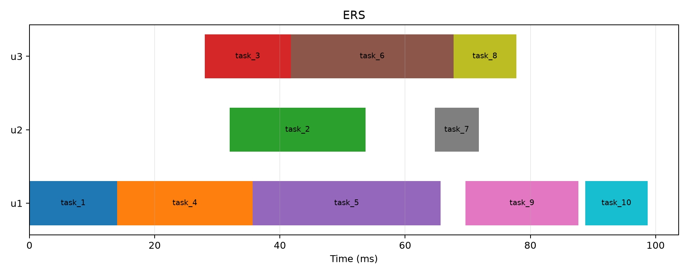

# ERS: Energy-efficient Real-time DAG Scheduling on Uniform Multiprocessor Embedded Systems

<div align="center">
  
  
  
</div>

<p align="center">
  
</p>

This repository contains a robust, open-source Python implementation of the **ESUM** and **ERS** scheduling algorithms presented in the paper *"ERS: Energy-efficient Real-time DAG Scheduling on Uniform Multiprocessor Embedded Systems"* (Senapati et al., VLSID 2024). The goal of this project is to provide a fully reproducible, modular, and mathematically rigorous simulation environment for energy-aware real-time DAG scheduling.

## ⚠️ Reproducibility Issues & Flaws in the Original Paper

During the implementation and rigorous unit-testing of these algorithms, several critical discrepancies between the paper's mathematical definitions and its published results were identified. This implementation strictly adheres to the mathematical equations and algorithmic pseudocode defined in the paper. The discrepancies in the output arise directly from manual tracing errors and omissions made by the authors in their publication.

### 1. The Contradictory Gantt Chart (Figure 2d)
The paper's ERS Gantt chart contains a manual human error that contradicts the authors' own Greedy processor allocation logic (ESUM - Algorithm 1). 
* **The Flaw:** The paper manually assigns `task_6` to processor `p2` and `task_7` to `p3`. However, mathematically calculating the Effective Finish Time (EFT) using Equation 11 shows that `task_6` finishes significantly earlier on `p3` (140.66 ms) than on `p2` (151.33 ms).
* **The Impact:** A strict, algorithmic execution of ESUM *must* assign `task_6` to `p3`. This codebase generates the mathematically correct assignment, which naturally results in a different schedule and dynamic energy footprint compared to the flawed hand-drawn Figure 2d.

### 2. The Missing `ecr` Parameter
Equation 4 introduces the Energy Consumption Rate (`ecr`) constant to calculate the communication energy overhead.
* **The Flaw:** The authors completely omitted the value of `ecr` in their Experimental Setup and Motivation Example sections.
* **The Impact:** To reproduce the paper's exact total energy claim of `160.65 W`, `ecr` must be hardcoded to `0.0`. If a realistic value (e.g., `ecr=0.5`) is applied, the total dynamic energy increases significantly due to communication overhead.

### 3. Ambiguity in Upward Rank Communication Cost
Equation 9 uses the communication cost ($c_{j,k}$) to calculate task ranks bottom-up.
* **The Flaw:** Since the exact processor assignment is unknown during the initial ranking phase, calculating a precise communication cost is impossible. 
* **Our Solution:** This codebase computes the **average transfer rate** across the entire uniform multiprocessor matrix to calculate an accurate topological rank, strictly aligning with the paper's uniform multiprocessor model definition.

### 4. Unspecified Tie-Breaking Rule
Algorithm 1 (ESUM) dictates choosing the processor with the minimum EFT, but it remains silent on how to break ties.
* **Our Solution:** We implemented an intelligent, locality-aware tie-breaking mechanism. If EFTs are equal, the algorithm favors the processor that already hosts the task's predecessors, minimizing unnecessary data transfer overhead.

---

## ✨ Features

* **ESUM Scheduler:** Rank-based list scheduler targeting makespan minimization.
* **ERS Scheduler:** Energy-minimizing algorithm using a dual-heap architecture (Max-Heap/Min-Heap) to dynamically scale processor frequencies.
* **Automated Evaluation:** Scripts to calculate the Normalized Energy Rate (NER), evaluate runtime scalability, and generate comparative Gantt charts.
* **Rigorous Testing:** Comprehensive `pytest` suite validating mathematical integrity, precedence constraints, and energy calculations.

## 📂 Project Structure

| Directory | Description |
| :--- | :--- |
| `src/` | Core algorithms (`ers.py`, `esum.py`), power models, and DAG architectures. |
| `motivation/` | Execution scripts to run the 10-task motivating example from the paper. |
| `experiments/` | Scripts to reproduce large-scale benchmark evaluations (Gaussian Elimination & Laplace). |
| `tests/` | Regression tests validating equation accuracy and hardware allocation logic. |

## 🚀 How to Run

**1. Install Dependencies**  
Ensure you have Python 3.10+ installed, then run:
```bash
pip install -r requirements.txt